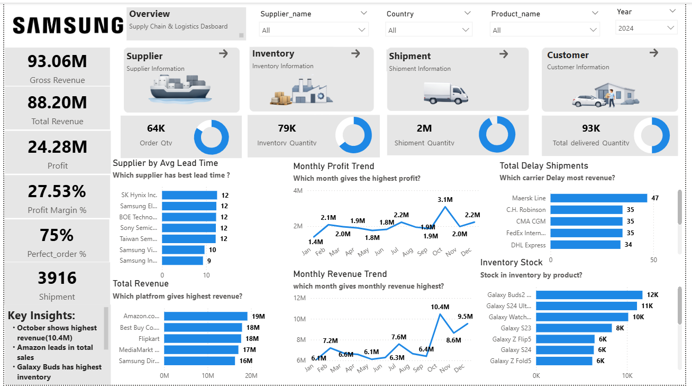

# 📦 Supply Chain Analytics Dashboard – Samsung | Power BI

📦 Business-Focused Supply Chain Dashboard for Revenue, Inventory & Logistics Optimization 

📌 End-to-End Project: Data Modeling (Star Schema) → DAX Calculations → Power BI Dashboard → Business Insights  

⭐ Highlight: Identified shipment delays, inventory inefficiencies, and top-performing sales channels impacting profitability  

---

## 🚀 Project Overview

This project analyzes **Samsung’s supply chain operations** using an interactive **Power BI dashboard**.

📊 Dataset includes multi-source operational data across sales, inventory, procurement, and logistics  

👉 The goal is to uncover insights into:
- Revenue & profit performance  
- Inventory management efficiency  
- Supplier and shipment performance  
- Customer demand patterns  

---

## 🎯 Business Problem

Large-scale supply chains face challenges in:

- Managing inventory efficiently  
- Reducing shipment delays  
- Identifying high-performing suppliers  
- Optimizing sales channels and profitability  

👉 Key Question:  
**How can supply chain operations be optimized to improve efficiency and profitability?**

---

## 🛠 Tools & Technologies

- Power BI – Dashboard Development  
- DAX – KPI Calculations  
- SQL – Data Querying & Transformation  
- Excel / CSV – Data Sources  
- Data Modeling – Star Schema  

---

## 📊 Data Model (Star Schema)

### 🔹 Dimension Tables
- dim_customer  
- dim_product  
- dim_supplier  
- dim_facility  
- dim_date  

### 🔹 Fact Tables
- fact_sales  
- fact_inventory  
- fact_shipment  
- fact_procurement  
- fact_production  

👉 Enables scalable and efficient analytics  

---

## 🔄 Data Processing Workflow

1. Data collection from multiple sources  
2. Data cleaning and preprocessing  
3. Star schema data modeling  
4. Data loading into Power BI  
5. Relationship building  
6. DAX KPI creation  
7. Dashboard development  

---

## 📈 Dashboard Features

### ✔ KPI Overview
- Total Revenue: **93.06M**  
- Total Sales: **88.20M**  
- Total Profit: **24.28M**  
- Profit Margin: **27.53%**  
- Total Shipments: **3916**  

---

### ✔ Supplier Performance
- Evaluates supplier efficiency using lead time  
- Identifies high-performing suppliers  
- Supports procurement optimization  

---

### ✔ Inventory Analysis
- Tracks stock levels across products  
- Identifies overstock and underperforming items  
- Helps reduce holding costs  

---

### ✔ Revenue & Profit Trends
- Monthly revenue and profit trends  
- Identifies peak business periods  
- Supports forecasting  

---

### ✔ Shipment & Delay Analysis
- Identifies delayed shipments  
- Analyzes carrier performance  
- Highlights logistics inefficiencies  

---

### ✔ Sales Channel Analysis
- Compares platforms (Amazon, Flipkart, Best Buy)  
- Identifies top revenue channels  

---

## 📊 Key Insights

- October recorded the highest revenue (~10.4M), indicating seasonal demand  
- Revenue shows strong growth in the final quarter  
- Amazon contributes the largest share of total sales  
- Sales are concentrated across a few major platforms  
- Inventory imbalance observed in multiple products (overstock vs low demand)  
- Shipment delays significantly impact delivery performance  
- Certain carriers contribute disproportionately to delays  
- Supplier lead time strongly affects operational efficiency  
- High revenue does not always translate to high profit margins  
- Better inventory planning can reduce costs and improve cash flow  

---

## 💡 Business Recommendations

- Optimize inventory distribution to reduce overstock  
- Improve logistics performance by addressing delayed carriers  
- Focus on high-performing sales channels  
- Partner with suppliers offering lower lead times  
- Implement cost optimization strategies for high-revenue products  

---

## 📷 Dashboard Preview

---

## 🎯 Impact

- Analyzed multi-source supply chain data to identify inefficiencies  
- Built an end-to-end BI solution using Power BI and DAX  
- Improved visibility into revenue, logistics, and inventory performance  
- Enabled data-driven decision-making for operational optimization  

---

## ⭐ Future Enhancements

- Predictive analytics for demand forecasting  
- Supplier performance scoring model  
- Integration with cloud platforms (AWS / Azure)  

---

## 👨‍💻 Author

**Chandan Kumar Sah**  
Data Analyst | SQL • Power BI • Python • Machine Learning  

---

⭐ If you found this project useful, consider giving it a **star**
