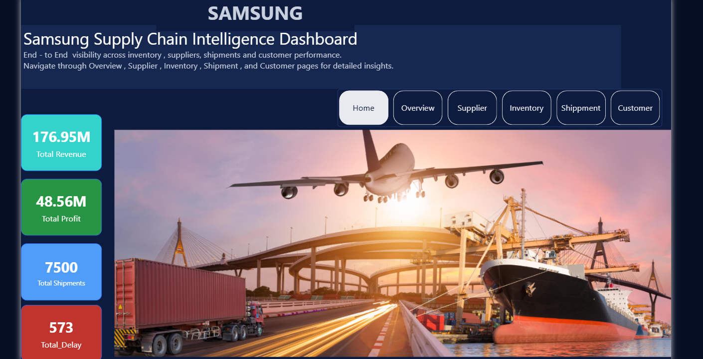
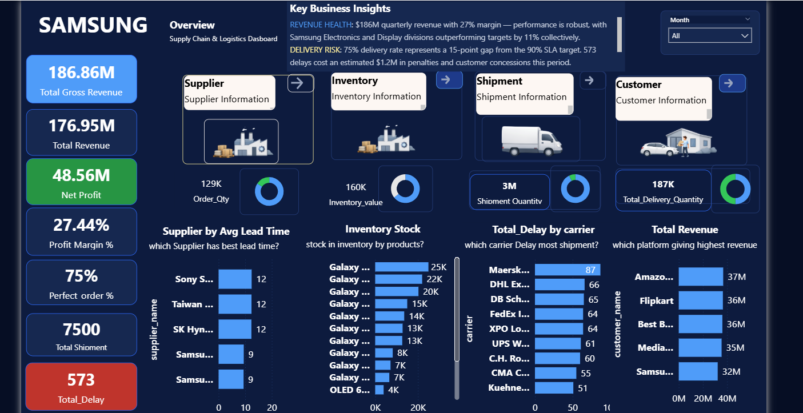
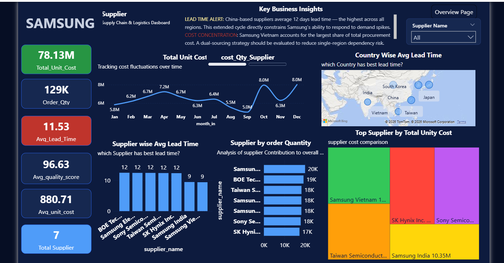
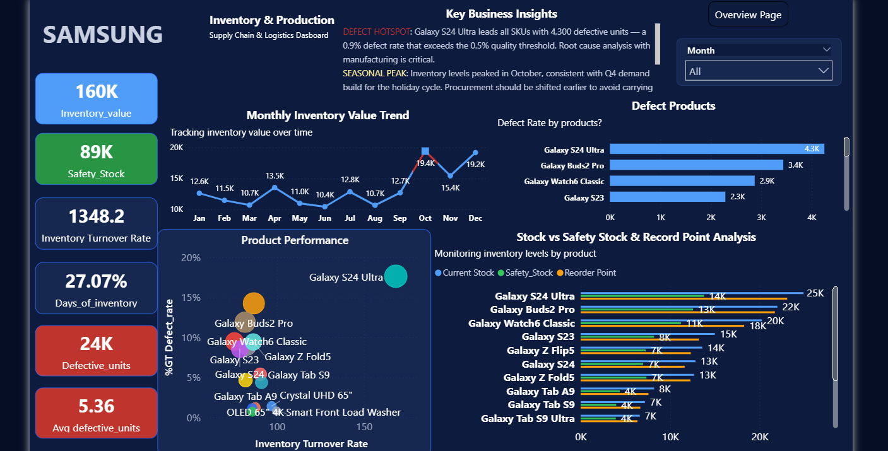
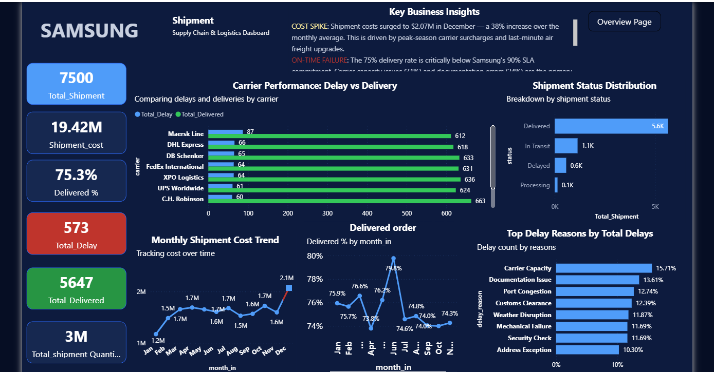
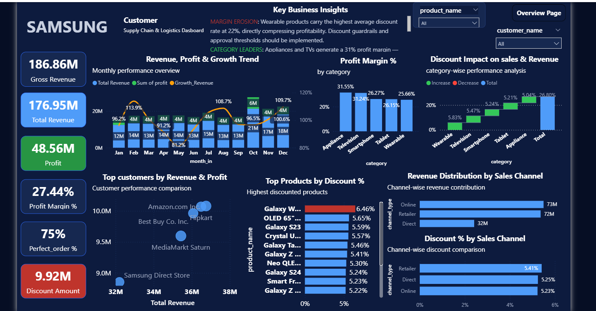

# 📦 Samsung Supply Chain Analytics Dashboard | Power BI

🚀 End-to-End Business Intelligence Project  
From Data Modeling → DAX → Dashboard → Business Insights  

---

## 📌 Project Overview

This project presents an interactive **Supply Chain Analytics Dashboard** built using Power BI to analyze:

- Revenue & Profit Performance  
- Inventory Efficiency  
- Shipment & Logistics Performance  
- Supplier Analysis  
- Customer & Sales Channels  

👉 Goal: Enable **data-driven decision-making** and optimize supply chain operations.

---

## ⭐ Key Highlights

- Built a **complete star schema data model**  
- Created **advanced DAX KPIs** for business insights  
- Identified **shipment delays & inventory inefficiencies**  
- Designed a **professional multi-page dashboard UI**  
- Delivered **actionable recommendations for optimization**  

---

## 🎯 Business Problem

Supply chain operations face challenges such as:

- Inventory mismanagement  
- Shipment delays  
- Inefficient supplier performance  
- Uneven revenue distribution  

👉 **Key Question:**  
How to optimize operations to improve efficiency & profitability?

---

## 🛠 Tech Stack

- Power BI  
- DAX  
- SQL  
- Excel / CSV  
- Data Modeling (Star Schema)  

---

## 🧠 Data Model (Star Schema)

### 🔹 Dimension Tables
- dim_customer  
- dim_product  
- dim_supplier  
- dim_facility  
- dim_date  

### 🔹 Fact Tables
- fact_sales  
- fact_inventory  
- fact_shipment  
- fact_procurement  
- fact_production  

---

## 🔄 Data Pipeline

1. Data Collection  
2. Data Cleaning  
3. Data Modeling  
4. Power BI Integration  
5. DAX Calculations  
6. Dashboard Development  

---

## 📊 Dashboard Features

### 📌 KPI Overview
- 💰 Revenue: **176.95M**  
- 📈 Profit: **48.56M**  
- 📦 Shipments: **7500**  
- 🚚 Delivery Rate: **75%**  
- ⚠ Delays: **573**

---

### 🏭 Supplier Analysis
- Lead time evaluation  
- Supplier performance comparison  

### 📦 Inventory Insights
- Stock tracking  
- Overstock detection  

### 🚚 Shipment Analysis
- Delay analysis  
- Carrier performance  

### 📈 Sales Insights
- Revenue trends  
- Profit margin analysis  

---

## 📸 Dashboard Preview

---

## 📈 Key Insights

- Q4 shows peak revenue (seasonal demand)  
- Inventory imbalance detected  
- Shipment delays impact service levels  
- High revenue ≠ high profit (discount impact)  

---

## 💡 Recommendations

- Optimize inventory distribution  
- Improve logistics efficiency  
- Focus on high-margin channels  
- Reduce supplier dependency  

---

## ▶️ How to Use

1. Download `.pbix` file  
2. Open in Power BI Desktop  
3. Explore dashboard pages  
4. Use filters & slicers  

---

## 🎯 Project Impact

✔ End-to-end BI solution  
✔ Improved operational visibility  
✔ Data-driven insights for decision making  

---

## 🔮 Future Improvements

- Demand forecasting (ML)  
- Supplier scoring system  
- Cloud integration  

---

## 👨‍💻 Author

**Chandan Kumar Sah**  
Data Analyst | SQL • Power BI • Python  

---

## ⭐ Support

If you like this project:

⭐ Star this repo  
🤝 Connect for collaboration  

---
